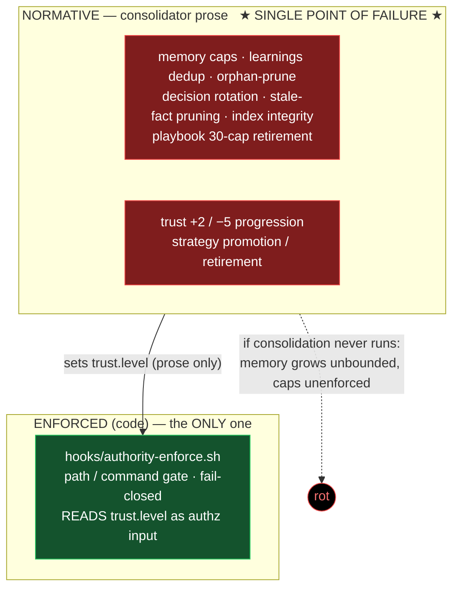
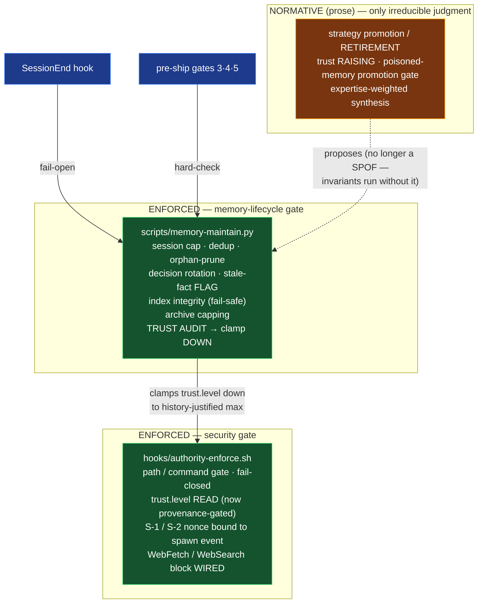
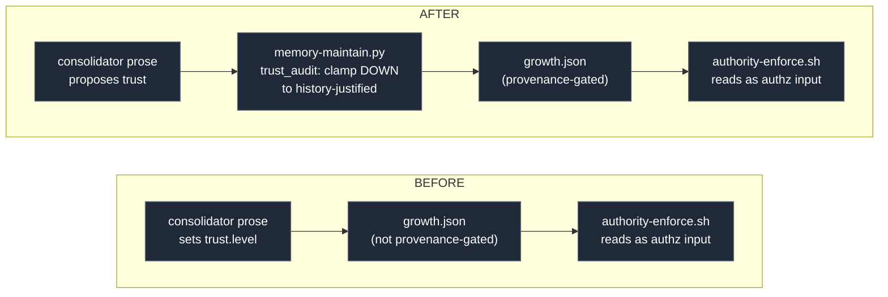

# Architecture Delta — v5.9.5 → v5.12.1

How the ainous-team architecture changed across the audit-and-refinement work. The single biggest
shift is the **enforcement boundary**: from one code-backed surface (with the entire memory/learning
lifecycle hanging on consolidator prose — a single point of failure) to **two** code-backed
subsystems, with prose reserved for decisions that genuinely require judgment.

---

## Enforcement architecture — BEFORE (v5.9.5)

**Pre-ship gates:** `[1] role-infra  [2] hook-env-vars`
**Open security:** S-1 (spawn-telemetry path traversal) · S-2 (write-proxy nonce redirect) · Q-12 (WebFetch block registered but never invoked)

---

## Enforcement architecture — AFTER (v5.12.1)

**Pre-ship gates:** `[1] role-infra  [2] hook-env  [3] mem-cap  [4] trust-audit  [5] model-consistency`
**Security:** S-1 closed · S-2 closed (all 4 tiers) · Q-12 wired · trust.level now provenance-gated

---

## The core shift: NORMATIVE → ENFORCED

This table *is* the architecture diff — what moved from "prose the LLM is asked to follow" to
"code-backed invariant."

| Mechanism | Before | After |
|---|---|---|
| Session / memory caps | prose | **ENFORCED** (`memory-maintain.py`) |
| learnings dedup / orphan-prune | prose | **ENFORCED** |
| Expired-decision rotation | prose | **ENFORCED** |
| Stale-fact flagging | prose | **ENFORCED** (deletion still judgment) |
| Knowledge-index integrity | prose | **ENFORCED** (fail-safe, >30% shrink guard) |
| Archive-file capping | did not exist (unbounded) | **ENFORCED** |
| **Trust clamping (down)** | prose, ungated | **ENFORCED** + provenance-gated |
| Trust raising | prose | prose (intentional — judgment) |
| Strategy promotion / retirement | prose | prose (intentional — judgment) |
| Model-field consistency | hand-managed | **ENFORCED** (Gate 5) |
| Pre-ship gates | 2 | **5** |
| Enforced subsystems | **1** | **2** |

---

## Trust data-flow — the security-relevant change

Before, the one value the fail-closed security gate trusts was set purely by prose and writable
without provenance. After, a wrong/escalated value is mechanically clamped down to what the role's own
session history justifies (fail-safe — only lowers, never raises), and the surface is provenance-gated.

---

## Secondary structural deltas

| Dimension | Before | After |
|---|---|---|
| Security: nonce path traversal (S-1) | open | closed (charset + realpath containment) |
| Security: cross-teammate nonce redirect (S-2) | open | closed across all 4 write-proxy tiers |
| Security: teammate WebFetch/Search block (Q-12) | dead code | wired into PreToolUse matcher |
| Skills vault | 57 | 54 (3 off-mission cut) |
| Orchestration docs | mis-filed as skills | moved to `commands/` (correct layer) |
| Dart `pm-client` (1,118 LOC) | shipped in package | extracted out of package |
| Dead scripts / templates | present | removed |
| Instruction Startup Sequence | duplicated across 9 role files | single `runtime-charter` reference |
| Model tiers | sonnet-heavy | consolidator + researcher → opus (aliases) |
| Newer-model features | none | opt-in docs (`effort`, `opusplan`, 1M); version-agnostic |

---

## One-sentence summary

**Before:** one enforced organ (the security gate) reading a trust value that prose set, with the
entire memory/learning lifecycle hanging on a single consolidator prompt nothing guaranteed would run.
**After:** two enforced organs — the security gate *and* a mechanical memory-lifecycle gate that bounds
memory and clamps trust every session end — with prose reduced to the decisions that genuinely require
judgment, and five pre-ship gates verifying it all.
