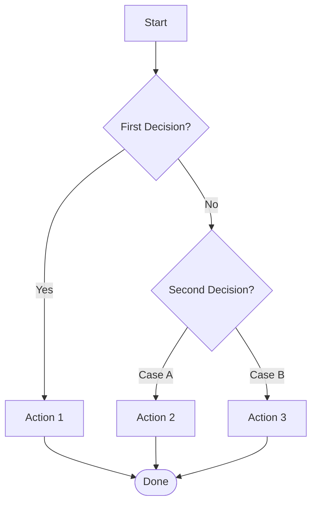

# Flowchart Decision Builder

## Core Principle

Every decision node must have exactly two or more labeled exits. Dead-end branches are bugs in your flowchart.

## Three Phases

### Phase 1: Identify Decision Points
- List every point where a choice is made
- For each decision: what are ALL possible outcomes? (not just yes/no — consider edge cases)
- Identify terminal states: where does each path end?

### Phase 2: Build the Graph
- Start node at the top
- Decision nodes are diamonds (rhombus in Mermaid: `{Decision?}`)
- Action nodes are rectangles (default in Mermaid)
- Terminal nodes use rounded rectangles (`([End])`)
- Every path must reach a terminal node

### Phase 3: Validate
- Trace every path from start to finish — no dead ends?
- Are all edge cases covered? What happens when none of the conditions match?
- Is the "happy path" the most visible path? (leftmost or straightest line)

## Mermaid Template

## Complexity Management

| Nodes | Action |
|-------|--------|
| ≤10 | Single flowchart — fine as is |
| 11-20 | Group with subgraphs |
| 20+ | Split into linked sub-flowcharts — reference by name |

## Anti-Patterns

- **Dead-end branch**: a path that doesn't reach a terminal node
- **Missing default**: a decision with yes/no but no "else" — what happens when input is unexpected?
- **Spaghetti flow**: arrows crossing everywhere. Restructure — use subgraphs or split.
- **Unlabeled edges**: every arrow from a decision node MUST have a label
- **Too many decisions inline**: more than 5 sequential decisions → likely need sub-flowcharts
